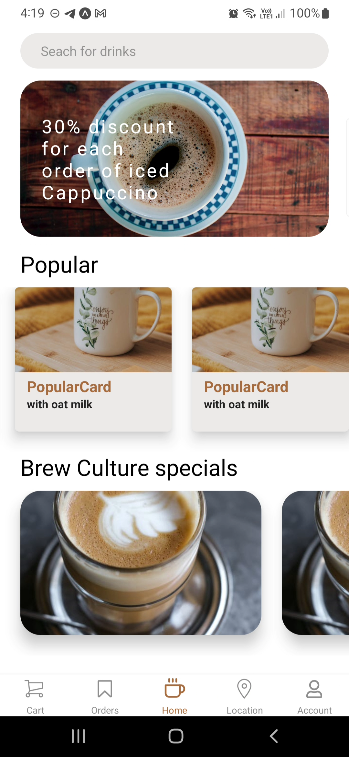

### Coffee App


<br>
This is a Coffee app written with React Native.
<br>

## How can I run the project in my pc ?

When you want to clone the project in your personal computer, you should run this command
<br>

```
npm install
```

and when you want to run this project
<br>

```
npx expo start
```

If you want to sync your clone with the original repo automatically:
<br>

```
git remote add upstream https://github.com/mustafadede/Coffee-App.git
```

```
git pull upstream main
```

If you want to sync your clone with the original repo automatically:
<br>

```
git remote add upstream https://github.com/mustafadede/Coffee-App.git
```

```
git pull upstream master
```

## Third Party Applications

- Firebase
- Redux
- React Navigation

<br>


<br>

