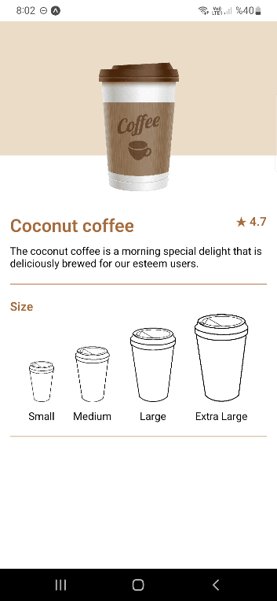

### Coffee App


<br>
This is a Coffee app written with React Native.
<br>

## How can I run the project in my pc ?

When you want to clone the project in your personal computer, you should run this command
<br>

```
npm install
```

and when you want to run this project
<br>

```
npx expo start
```

<br>



